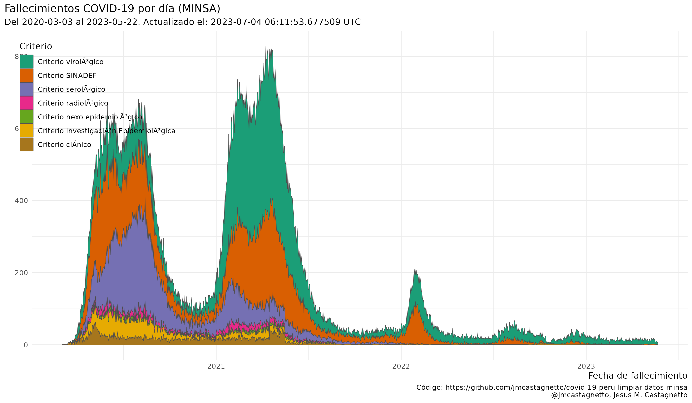
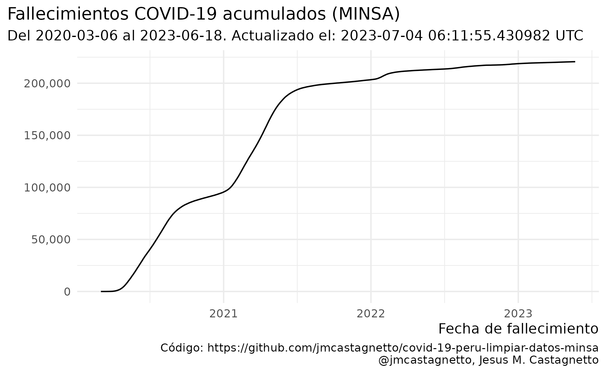
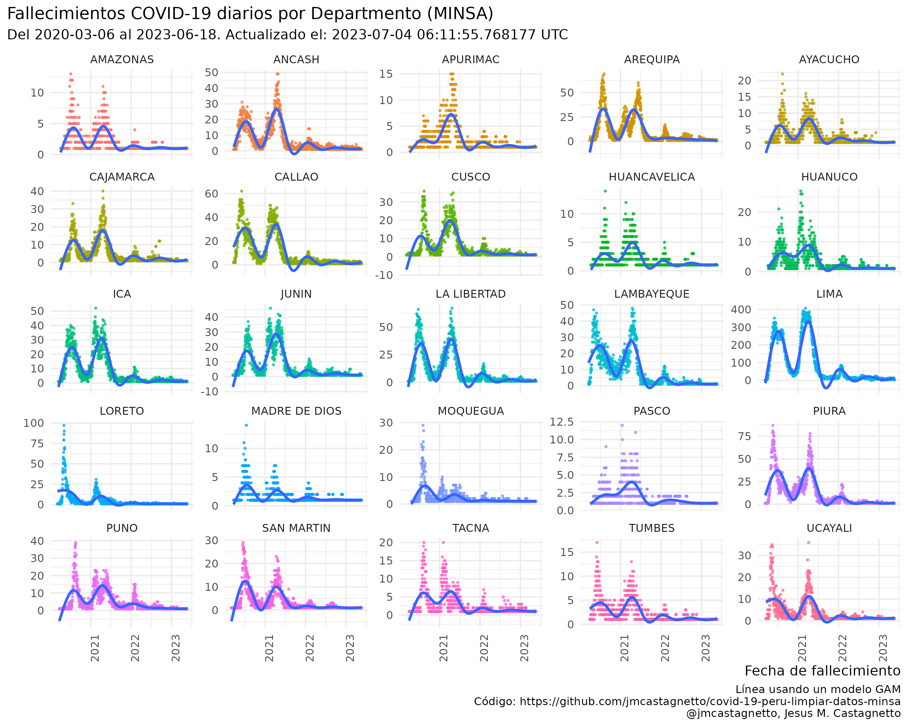
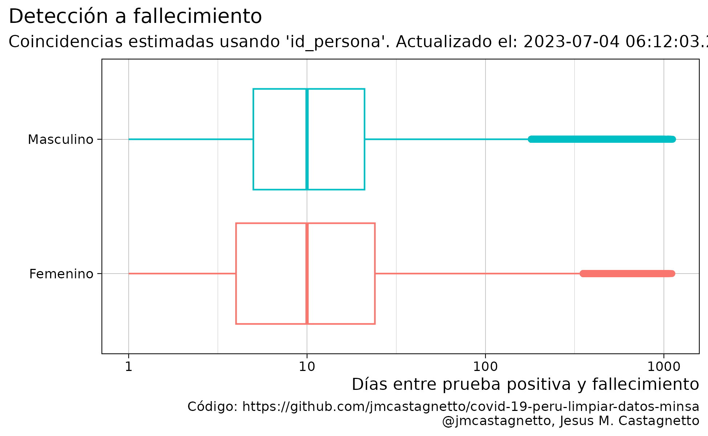

```{r include=FALSE, echo=FALSE}
knitr::opts_chunk$set(
  echo = FALSE,
  warning = FALSE,
  message = FALSE,
  comment = ""
)
suppressPackageStartupMessages(library(tidyverse))
positivos <- readRDS("datos/positivos_covid_aumentado.rds")
fallecidos <- readRDS("datos/fallecidos_covid_aumentado.rds")
reconstruido <- readRDS("datos/positivos_fallecidos_reconstruccion.rds")
```

[](https://zenodo.org/badge/latestdoi/266025854)


**Última actualización**: `r lubridate::now(tzone = "UTC")` UTC

<details>

<summary>

## Notas 

</summary>

**2020-05-22**

- La limpieza de datos no está completa aún, hay fechas de tomas de prueba que parecen ser incorrectas, y que al convertir dan fechas inconsistentes con el primer caso reportado (2020-03-06). 
- En al menos un caso, la fecha de toma de pruebas es copia de la fecha de nacimiento. 
- He agregado una columna `fecha_prueba_antes_primer_caso` para marcar esos registros. Son 126 registros que tienen este problema.

**2020-05-23**

- Los datos han cambiado de formato, ya no incluyen la fecha de nacimiento, sino la edad en años.
- El campo de fecha que se tiene ahora ya no es `FECHA_PRUEBA` sino `FECHA_RESULTADO`
- El campo de tipo de prueba (antes `TIPO_PRUEBA`) se llama ahora `METODODX`
- Hay 4,543 registros sin fecha de resultado conocida
- Ya no hay incosistencias en los formatos de fecha, todos los registros con valores son de la forma "DD/MM/YYYY"
- Tampoco hay errores como fechas anteriores al primer caso reportado oficialmente.
- Usando edad, departamento, provincia y distrito se han podidor reconstruir unos 2,933 registros de casos con fallecimientos

**2020-05-28**

- Hay nuevos datasets de positivos y fallecimientos, ahora ambos en formato CSV, pero no en UTF-8:
  - ["Casos positivos por COVID-19 - [Ministerio de Salud - MINSA]"](https://www.datosabiertos.gob.pe/dataset/casos-positivos-por-covid-19-ministerio-de-salud-minsa)
  - ["Fallecidos por COVID-19 - [Ministerio de Salud - MINSA]"](https://www.datosabiertos.gob.pe/dataset/fallecidos-por-covid-19-ministerio-de-salud-minsa)

**2020-05-31**

- Nuevo cambio de formato en los datos de fallecimientos: en 749 de registros no se consigna la fecha de nacimiento, pero se ha agregado una columna `EDAD_DECLARADA`. 
- He modificado el código para compensar por estos cambios.
- También, **todos los 141 fallecimientos asignados al 2020-05-29 están designados como de sexo `INDETERMINADO`**.

**2020-06-12**

- Al menos a partir de ayer, ya aparecen nuevamente los valores definidos para el sexo en los datos.

**2020-06-23**

- Hay datos que tienen como fecha de el 2020-12-06, cuando podría parecer que es 2020-06-12, esto se ha corregido en los datos limpios en el repo, mas no el original.


**2020-07-28**

- Luego de varios días sin actualización (al menos 3 días), los datos abiertos han sido actualizados.
- Las fechas en los registros ha cambiado del formato DD/MM/YYY (y algunos MM/DD/YYYY) a YYYYMMDD

**2020-09-14**

- Modificado el código de proceso de datos pues hay un campo mas: `FECHA_CORTE`

**2020-10-25**

- Tanto los datos de casos positivos, como los de fallecimentos, tienen ahora un formato distinto, en lugar de usar coma (",") para separar campos, hoy aparecen con punto y coma (";")

**2020-11-08**

- Al menos desde el 2020-11-04, no han habido actualizaciones de los datos abiertos.
- El hash sha1 de los archivos no ha cambiado hasta ahora:

**2020-11-16**

- Los datos abiertos no se han actualizado desde el 2020-11-13 (última revisión: 2020-11-16, 23:15h PET)

**2021-08-25**

- Debido a la "Datatón 2021" del MINSA, los datos ahora incluyen `person_id` que se puede usar para poder enlazar información entre datasets. He reorganizados los datos en función a esto, y aprovechado para aumentar la información original.


```
26ea469be125d1d0c4e8f9dcedf6692ece12acbb  datos/originales/fallecidos_covid.csv
ada0b5da4371b9308e4170ecb53014843e4cb3a2  datos/originales/positivos_covid.csv
```

**2021-06-02**

- A partir de hoy los datos de fallecidos por COVID-19 usan los criterios publicados en [Criterios técnicos para actualizar la cifra de fallecidos por COVID-19 en el Perú](https://www.gob.pe/institucion/pcm/informes-publicaciones/1943691-criterios-tecnicos-para-actualizar-la-cifra-de-fallecidos-por-covid-19-en-el-peru), y se ha cambiado la estructura de los datos. Ahora los datos de fallecidos indican en un campo el criterio empleado para la clasificación.
- Debido al tamaño de los nuevos archivos de datos, estoy cambiando de formato de compresión, usando ahora [xz](https://tukaani.org/xz/) en lugar de [gzip](https://en.wikipedia.org/wiki/Gzip)

</details>


## Información relevante

Fuentes de datos:

- https://www.datosabiertos.gob.pe/dataset/casos-positivos-por-covid-19-ministerio-de-salud-minsa
- https://www.datosabiertos.gob.pe/dataset/fallecidos-por-covid-19-ministerio-de-salud-minsa

Luego del primer paso de limpieza de datos:

<details>
<summary>

### Casos positivos

</summary>


```{r comment=""}
skimr::skim(positivos)
```

</details>

<details>
<summary>

### Fallecimientos

</summary>


```{r comment=""}
skimr::skim(fallecidos)
```

</details>


<details>
<summary>

### Reconstrucción de positivos a fallecidos

</summary>


```{r comment=""}
skimr::skim(reconstruido)
```

</details>

## Gráficos


```{r echo=FALSE}
plot_df <- positivos %>% 
  mutate(
    sexo = str_replace_na(sexo, "No registrado")
  ) %>% 
  group_by(fecha_resultado, sexo) %>% 
  tally() %>% 
  filter(!is.na(fecha_resultado)) %>% 
  arrange(fecha_resultado)

dummy <- Sys.setlocale("LC_TIME", "es_PE.utf8")
plot_positivos <- ggplot(
  plot_df,
  aes(x = fecha_resultado, y = n, group = sexo, fill = sexo)
) +
  geom_col() +
  scale_x_date() +
  labs(
    fill = "Sexo",
    x = "Fecha de resultado",
    y = "",
    title = "Positivos COVID-19 por día (MINSA)",
    subtitle = paste0(
      "Del ", min(plot_df$fecha_resultado), " al ",
      max(plot_df$fecha_resultado),
      ". Actualizado el: ",
                      lubridate::now(tzone = "UTC"), " UTC"),
    caption = "Código: https://github.com/jmcastagnetto/covid-19-peru-limpiar-datos-minsa\n@jmcastagnetto, Jesus M. Castagnetto"
  ) +
  theme_minimal() +
  theme(
    plot.title.position = "plot",
    legend.position = c(.2, .8),
    axis.title.x.bottom = element_text(hjust = 1)
  )

ggsave(
  plot = plot_positivos,
  filename = "plots/positivos-por-dia-minsa.png",
  width = 6.5,
  height = 4
)

plot_acum_df <- positivos %>% 
  group_by(fecha_resultado) %>% 
  tally() %>% 
  filter(!is.na(fecha_resultado)) %>% 
  arrange(fecha_resultado) %>% 
  mutate(
    n_acum = cumsum(n)
  )

plot_positivos_acum <- ggplot(
  plot_acum_df,
  aes(x = fecha_resultado, y = n_acum)
) +
 # geom_point(size = .5) +
  geom_line() +
  scale_y_continuous(labels = scales::comma) +
  scale_x_date() +
  labs(
    x = "Fecha de resultado",
    y = "",
    title = "Positivos COVID-19 acumulados (MINSA)",
    subtitle = paste0(
      "Del ", min(plot_df$fecha_resultado), " al ",
      max(plot_df$fecha_resultado),
      ". Actualizado el: ",
                      lubridate::now(tzone = "UTC"), " UTC"),
    caption = "Código: https://github.com/jmcastagnetto/covid-19-peru-limpiar-datos-minsa\n@jmcastagnetto, Jesus M. Castagnetto"
  ) +
  theme_minimal() +
  theme(
    plot.title.position = "plot",
    axis.title.x.bottom = element_text(hjust = 1)
  )

ggsave(
  plot = plot_positivos_acum,
  filename = "plots/positivos-acumulados-minsa.png",
  width = 6.5,
  height = 4
)

ts_positivos_dep <- read_csv("datos/timeseries_positivos_departamento.csv")

ts_positivos_dep_plot <- ggplot(
  ts_positivos_dep,
  aes(x = fecha_resultado, y = n, group = departamento)
) +
  geom_point(aes(color = departamento), 
             alpha = .7, size = .5,
             show.legend = FALSE) +
  geom_smooth(method = "gam") +
  scale_x_date() +
  theme_minimal() +
  theme(
    plot.title.position = "plot",
    axis.title.x.bottom = element_text(hjust = 1),
    axis.text.x.bottom = element_text(angle = 90, hjust = 1)
  ) +
  labs(
    x = "Fecha de resultado",
    y = "",
    title = "Positivos COVID-19 diarios por Departmento (MINSA)",
    subtitle = paste0(
      "Del ", min(ts_positivos_dep$fecha_resultado, na.rm = TRUE), " al ",
      max(ts_positivos_dep$fecha_resultado, na.rm = TRUE),
      ". Actualizado el: ",
                      lubridate::now(tzone = "UTC"), " UTC"),
    caption = "Línea usando un modelo GAM\nCódigo: https://github.com/jmcastagnetto/covid-19-peru-limpiar-datos-minsa\n@jmcastagnetto, Jesus M. Castagnetto"
  ) +
  facet_wrap(~departamento, scales = "free_y", ncol = 7) 

ggsave(
  plot = ts_positivos_dep_plot,
  filename = "plots/positivos-diarios-por-departamento-minsa.png",
  width = 12,
  height = 8
)

```


<details>
<summary>Casos positivos por dia (MINSA)</summary>


</details>

<details>
<summary>Casos positivos acumulados (MINSA)</summary>


</details>

<details>
<summary>Casos positivos por dia y Departamento (MINSA)</summary>


</details>

```{r echo=FALSE}
plot_fall_df <- fallecidos %>% 
  group_by(fecha_fallecimiento, sexo) %>% 
  tally() %>% 
  arrange(fecha_fallecimiento)

plot_fallecidos <- ggplot(
  plot_fall_df,
  aes(x = fecha_fallecimiento, y = n, 
      group = sexo, fill = sexo)
) +
  geom_col() +
  scale_x_date() +
  labs(
    fill = "Sexo",
    x = "Fecha de fallecimiento",
    y = "",
    title = "Fallecimientos COVID-19 por día (MINSA)",
    subtitle = paste0(
      "Del ", min(plot_fall_df$fecha_fallecimiento), " al ",
      max(plot_fall_df$fecha_fallecimiento),
      ". Actualizado el: ",
                      lubridate::now(tzone = "UTC"), " UTC"),
    caption = "Código: https://github.com/jmcastagnetto/covid-19-peru-limpiar-datos-minsa\n@jmcastagnetto, Jesus M. Castagnetto"
  ) +
  theme_minimal() +
  theme(
    plot.title.position = "plot",
    legend.position = c(.2, .8),
    axis.title.x.bottom = element_text(hjust = 1),
    axis.text.x.bottom = element_text(angle = 90, hjust = 1)
  )

ggsave(
  plot = plot_fallecidos,
  filename = "plots/fallecidos-por-dia-minsa.png",
  width = 6.5,
  height = 4
)

fall_clas_df <- fallecidos %>% 
  mutate(
    clasificacion_def = factor(clasificacion_def) %>% 
      fct_rev()
  ) %>% 
  group_by(fecha_fallecimiento, clasificacion_def) %>% 
  tally() 

fall_clas_plot <- ggplot(
  fall_clas_df,
  aes(x = fecha_fallecimiento, y = n, fill = clasificacion_def)
) +
  geom_area(color = "grey30", size = .2) +
  scale_fill_brewer(type = "qual", palette = "Dark2") +
    labs(
    fill = "Criterio",
    x = "Fecha de fallecimiento",
    y = "",
    title = "Fallecimientos COVID-19 por día (MINSA)",
    subtitle = paste0(
      "Del ", min(plot_fall_df$fecha_fallecimiento), " al ",
      max(plot_fall_df$fecha_fallecimiento),
      ". Actualizado el: ",
                      lubridate::now(tzone = "UTC"), " UTC"),
    caption = "Código: https://github.com/jmcastagnetto/covid-19-peru-limpiar-datos-minsa\n@jmcastagnetto, Jesus M. Castagnetto"
  ) +
  theme_minimal() +
  theme(
    plot.title.position = "plot",
    legend.position = c(.1, .8),
    axis.title.x.bottom = element_text(hjust = 1)
  )

ggsave(
  plot = fall_clas_plot,
  filename = "plots/fallecidos-diarios-por-criterio.png",
  width = 12,
  height = 7
)

plot_fall_acum_df <- fallecidos %>% 
  group_by(fecha_fallecimiento) %>% 
  tally() %>% 
  filter(!is.na(fecha_fallecimiento)) %>% 
  arrange(fecha_fallecimiento) %>% 
  mutate(
    n_acum = cumsum(n)
  )

plot_fallecidos_acum <- ggplot(
  plot_fall_acum_df,
  aes(x = fecha_fallecimiento, y = n_acum)
) +
  #geom_point(size = .5) +
  geom_line() +
  scale_y_continuous(labels = scales::comma) +
  labs(
    x = "Fecha de fallecimiento",
    y = "",
    title = "Fallecimientos COVID-19 acumulados (MINSA)",
    subtitle = paste0(
      "Del ", min(plot_df$fecha_resultado), " al ",
      max(plot_df$fecha_resultado),
      ". Actualizado el: ",
                      lubridate::now(tzone = "UTC"), " UTC"),
    caption = "Código: https://github.com/jmcastagnetto/covid-19-peru-limpiar-datos-minsa\n@jmcastagnetto, Jesus M. Castagnetto"
  ) +
  theme_minimal() +
  theme(
    plot.title.position = "plot",
    axis.title.x.bottom = element_text(hjust = 1)
  )

ggsave(
  plot = plot_fallecidos_acum,
  filename = "plots/fallecidos-acumulados-minsa.png",
  width = 6.5,
  height = 4
)

ts_fallecidos_dep <- read_csv("datos/timeseries_fallecidos_departamento.csv")

ts_fallecidos_dep_plot <- ggplot(
  ts_fallecidos_dep,
  aes(x = fecha_fallecimiento, y = n, group = departamento)
) +
  geom_point(aes(color = departamento), 
             alpha = .7, size = .5, show.legend = FALSE) +
  geom_smooth(method = "gam") +
  scale_x_date() +
  theme_minimal() +
  theme(
    plot.title.position = "plot",
    axis.title.x.bottom = element_text(hjust = 1),
    axis.text.x.bottom = element_text(angle = 90, hjust = 1)
  ) +
  labs(
    x = "Fecha de fallecimiento",
    y = "",
    title = "Fallecimientos COVID-19 diarios por Departmento (MINSA)",
    subtitle = paste0(
      "Del ", min(ts_positivos_dep$fecha_resultado, na.rm = TRUE), " al ",
      max(ts_positivos_dep$fecha_resultado, na.rm = TRUE),
      ". Actualizado el: ",
                      lubridate::now(tzone = "UTC"), " UTC"),
    caption = "Línea usando un modelo GAM\nCódigo: https://github.com/jmcastagnetto/covid-19-peru-limpiar-datos-minsa\n@jmcastagnetto, Jesus M. Castagnetto"
  ) +
  facet_wrap(~departamento, scales = "free_y", nrow = 5) 

ggsave(
  plot = ts_fallecidos_dep_plot,
  filename = "plots/fallecidos-diarios-por-departamento-minsa.png",
  width = 10,
  height = 8
)


```

<details>
<summary>Fallecimientos por día (MINSA)</summary>


</details>

<details>
<summary>Fallecimientos por día y criterio (MINSA)</summary>



</details>

<details>
<summary>Fallecimientos acumulados (MINSA)</summary>



</details>

<details>
<summary>Fallecimientos por día y Departamento (MINSA)</summary>



</details>


```{r echo=FALSE}
plot_reconstruido_df <- reconstruido %>% 
  mutate(
    dias_caso_fall = lubridate::interval(
      positivo_fecha_resultado,
      fallecido_fecha_fallecimiento
    ) %/% lubridate::days()
  )

plot_reconstruido_dist <- ggplot(
  plot_reconstruido_df,
  aes(x = dias_caso_fall, y = positivo_sexo)
) +
  geom_boxplot(aes(color = positivo_sexo), show.legend = FALSE) +
  scale_x_log10() +
  labs(
    x = "Días entre prueba positiva y fallecimiento",
    y = "",
    title = "Detección a fallecimiento",
    subtitle = paste0(
      "Coincidencias estimadas usando 'id_persona'. Actualizado el: ",
      lubridate::now(tzone = "UTC"), " UTC"),
    caption = "Código: https://github.com/jmcastagnetto/covid-19-peru-limpiar-datos-minsa\n@jmcastagnetto, Jesus M. Castagnetto"
  ) +
  theme_linedraw() +
  theme(
    plot.title.position = "plot",
    axis.title.x.bottom = element_text(hjust = 1)
  )

ggsave(
  plot = plot_reconstruido_dist,
  filename = "plots/deteccion-fallecimiento-por-coincidentes.png",
  width = 6.5,
  height = 4
)

```


<details>
<summary>Distribución de tiempos desde detección a fallecimiento, por número de registros coincidentes</summary>



</details>

Los archivos procesados y aumentados son:

- [datos/fallecidos_covid_aumentado.csv.xz](datos/fallecidos_covid_aumentado.csv.xz)
- [datos/positivos_covid_aumentado.csv.xz](datos/datos/positivos_covid_aumentado.csv.xz)

Y algunos reconstruidos a partir de los anteriores:

- [datos/positivos_fallecidos_reconstruccion.csv.xz](datos/positivos_fallecidos_reconstruccion.csv.xz)
- [datos/timeseries_positivos.csv](datos/timeseries_positivos.csv.xz)
- [datos/timeseries_positivos_departamento.csv](datos/timeseries_positivos_departamento.csv)
- [datos/timeseries_fallecidos.csv](datos/timeseries_fallecidos.csv)
- [datos/timeseries_fallecidos_departamento.csv](datos/timeseries_fallecidos_departamento.csv)

