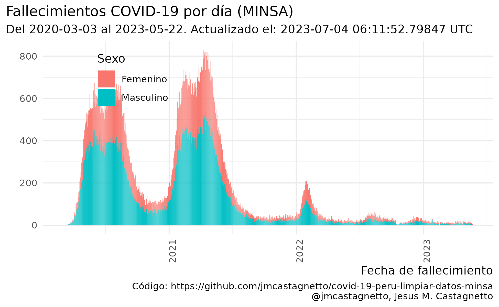

**Última actualización**: 2021-12-21 08:05:01 UTC

## Notas

**2020-05-22**

-   La limpieza de datos no está completa aún, hay fechas de tomas de
    prueba que parecen ser incorrectas, y que al convertir dan fechas
    inconsistentes con el primer caso reportado (2020-03-06).
-   En al menos un caso, la fecha de toma de pruebas es copia de la
    fecha de nacimiento.
-   He agregado una columna `fecha_prueba_antes_primer_caso` para marcar
    esos registros. Son 126 registros que tienen este problema.

**2020-05-23**

-   Los datos han cambiado de formato, ya no incluyen la fecha de
    nacimiento, sino la edad en años.
-   El campo de fecha que se tiene ahora ya no es `FECHA_PRUEBA` sino
    `FECHA_RESULTADO`
-   El campo de tipo de prueba (antes `TIPO_PRUEBA`) se llama ahora
    `METODODX`
-   Hay 4,543 registros sin fecha de resultado conocida
-   Ya no hay incosistencias en los formatos de fecha, todos los
    registros con valores son de la forma “DD/MM/YYYY”
-   Tampoco hay errores como fechas anteriores al primer caso reportado
    oficialmente.
-   Usando edad, departamento, provincia y distrito se han podidor
    reconstruir unos 2,933 registros de casos con fallecimientos

**2020-05-28**

-   Hay nuevos datasets de positivos y fallecimientos, ahora ambos en
    formato CSV, pero no en UTF-8:
    -   [“Casos positivos por COVID-19 - \[Ministerio de Salud -
        MINSA\]”](https://www.datosabiertos.gob.pe/dataset/casos-positivos-por-covid-19-ministerio-de-salud-minsa)
    -   [“Fallecidos por COVID-19 - \[Ministerio de Salud -
        MINSA\]”](https://www.datosabiertos.gob.pe/dataset/fallecidos-por-covid-19-ministerio-de-salud-minsa)

**2020-05-31**

-   Nuevo cambio de formato en los datos de fallecimientos: en 749 de
    registros no se consigna la fecha de nacimiento, pero se ha agregado
    una columna `EDAD_DECLARADA`.
-   He modificado el código para compensar por estos cambios.
-   También, **todos los 141 fallecimientos asignados al 2020-05-29
    están designados como de sexo `INDETERMINADO`**.

**2020-06-12**

-   Al menos a partir de ayer, ya aparecen nuevamente los valores
    definidos para el sexo en los datos.

**2020-06-23**

-   Hay datos que tienen como fecha de el 2020-12-06, cuando podría
    parecer que es 2020-06-12, esto se ha corregido en los datos limpios
    en el repo, mas no el original.

**2020-07-28**

-   Luego de varios días sin actualización (al menos 3 días), los datos
    abiertos han sido actualizados.
-   Las fechas en los registros ha cambiado del formato DD/MM/YYY (y
    algunos MM/DD/YYYY) a YYYYMMDD

**2020-09-14**

-   Modificado el código de proceso de datos pues hay un campo mas:
    `FECHA_CORTE`

**2020-10-25**

-   Tanto los datos de casos positivos, como los de fallecimentos,
    tienen ahora un formato distinto, en lugar de usar coma (“,”) para
    separar campos, hoy aparecen con punto y coma (“;”)

**2020-11-08**

-   Al menos desde el 2020-11-04, no han habido actualizaciones de los
    datos abiertos.
-   El hash sha1 de los archivos no ha cambiado hasta ahora:

**2020-11-16**

-   Los datos abiertos no se han actualizado desde el 2020-11-13 (última
    revisión: 2020-11-16, 23:15h PET)

**2021-08-25**

-   Debido a la “Datatón 2021” del MINSA, los datos ahora incluyen
    `person_id` que se puede usar para poder enlazar información entre
    datasets. He reorganizados los datos en función a esto, y
    aprovechado para aumentar la información original.

<!-- -->

    26ea469be125d1d0c4e8f9dcedf6692ece12acbb  datos/originales/fallecidos_covid.csv
    ada0b5da4371b9308e4170ecb53014843e4cb3a2  datos/originales/positivos_covid.csv

**2021-06-02**

-   A partir de hoy los datos de fallecidos por COVID-19 usan los
    criterios publicados en [Criterios técnicos para actualizar la cifra
    de fallecidos por COVID-19 en el
    Perú](https://www.gob.pe/institucion/pcm/informes-publicaciones/1943691-criterios-tecnicos-para-actualizar-la-cifra-de-fallecidos-por-covid-19-en-el-peru),
    y se ha cambiado la estructura de los datos. Ahora los datos de
    fallecidos indican en un campo el criterio empleado para la
    clasificación.
-   Debido al tamaño de los nuevos archivos de datos, estoy cambiando de
    formato de compresión, usando ahora [xz](https://tukaani.org/xz/) en
    lugar de [gzip](https://en.wikipedia.org/wiki/Gzip)

## Información relevante

Fuentes de datos:

-   <https://www.datosabiertos.gob.pe/dataset/casos-positivos-por-covid-19-ministerio-de-salud-minsa>
-   <https://www.datosabiertos.gob.pe/dataset/fallecidos-por-covid-19-ministerio-de-salud-minsa>

Luego del primer paso de limpieza de datos:

### Casos positivos

<table>
<caption>Data summary</caption>
<tbody>
<tr class="odd">
<td style="text-align: left;">Name</td>
<td style="text-align: left;">positivos</td>
</tr>
<tr class="even">
<td style="text-align: left;">Number of rows</td>
<td style="text-align: left;">711947</td>
</tr>
<tr class="odd">
<td style="text-align: left;">Number of columns</td>
<td style="text-align: left;">16</td>
</tr>
<tr class="even">
<td style="text-align: left;">_______________________</td>
<td style="text-align: left;"></td>
</tr>
<tr class="odd">
<td style="text-align: left;">Column type frequency:</td>
<td style="text-align: left;"></td>
</tr>
<tr class="even">
<td style="text-align: left;">character</td>
<td style="text-align: left;">1</td>
</tr>
<tr class="odd">
<td style="text-align: left;">Date</td>
<td style="text-align: left;">2</td>
</tr>
<tr class="even">
<td style="text-align: left;">factor</td>
<td style="text-align: left;">10</td>
</tr>
<tr class="odd">
<td style="text-align: left;">numeric</td>
<td style="text-align: left;">3</td>
</tr>
<tr class="even">
<td style="text-align: left;">________________________</td>
<td style="text-align: left;"></td>
</tr>
<tr class="odd">
<td style="text-align: left;">Group variables</td>
<td style="text-align: left;">None</td>
</tr>
</tbody>
</table>

Data summary

**Variable type: character**

<table>
<thead>
<tr class="header">
<th style="text-align: left;">skim_variable</th>
<th style="text-align: right;">n_missing</th>
<th style="text-align: right;">complete_rate</th>
<th style="text-align: right;">min</th>
<th style="text-align: right;">max</th>
<th style="text-align: right;">empty</th>
<th style="text-align: right;">n_unique</th>
<th style="text-align: right;">whitespace</th>
</tr>
</thead>
<tbody>
<tr class="odd">
<td style="text-align: left;">id_persona</td>
<td style="text-align: right;">1</td>
<td style="text-align: right;">1</td>
<td style="text-align: right;">1</td>
<td style="text-align: right;">8</td>
<td style="text-align: right;">0</td>
<td style="text-align: right;">687044</td>
<td style="text-align: right;">0</td>
</tr>
</tbody>
</table>

**Variable type: Date**

<table>
<thead>
<tr class="header">
<th style="text-align: left;">skim_variable</th>
<th style="text-align: right;">n_missing</th>
<th style="text-align: right;">complete_rate</th>
<th style="text-align: left;">min</th>
<th style="text-align: left;">max</th>
<th style="text-align: left;">median</th>
<th style="text-align: right;">n_unique</th>
</tr>
</thead>
<tbody>
<tr class="odd">
<td style="text-align: left;">fecha_corte</td>
<td style="text-align: right;">0</td>
<td style="text-align: right;">1</td>
<td style="text-align: left;">2021-12-19</td>
<td style="text-align: left;">2021-12-19</td>
<td style="text-align: left;">2021-12-19</td>
<td style="text-align: right;">1</td>
</tr>
<tr class="even">
<td style="text-align: left;">fecha_resultado</td>
<td style="text-align: right;">635</td>
<td style="text-align: right;">1</td>
<td style="text-align: left;">2020-03-06</td>
<td style="text-align: left;">2021-12-19</td>
<td style="text-align: left;">2021-02-02</td>
<td style="text-align: right;">650</td>
</tr>
</tbody>
</table>

**Variable type: factor**

<table>
<colgroup>
<col style="width: 18%" />
<col style="width: 8%" />
<col style="width: 12%" />
<col style="width: 7%" />
<col style="width: 8%" />
<col style="width: 44%" />
</colgroup>
<thead>
<tr class="header">
<th style="text-align: left;">skim_variable</th>
<th style="text-align: right;">n_missing</th>
<th style="text-align: right;">complete_rate</th>
<th style="text-align: left;">ordered</th>
<th style="text-align: right;">n_unique</th>
<th style="text-align: left;">top_counts</th>
</tr>
</thead>
<tbody>
<tr class="odd">
<td style="text-align: left;">departamento</td>
<td style="text-align: right;">0</td>
<td style="text-align: right;">1.00</td>
<td style="text-align: left;">FALSE</td>
<td style="text-align: right;">25</td>
<td style="text-align: left;">LIM: 304551, ARE: 38837, CAL: 31140, JUN: 29691</td>
</tr>
<tr class="even">
<td style="text-align: left;">provincia</td>
<td style="text-align: right;">0</td>
<td style="text-align: right;">1.00</td>
<td style="text-align: left;">FALSE</td>
<td style="text-align: right;">197</td>
<td style="text-align: left;">LIM: 258498, EN : 35770, ARE: 31910, CAL: 29596</td>
</tr>
<tr class="odd">
<td style="text-align: left;">distrito</td>
<td style="text-align: right;">0</td>
<td style="text-align: right;">1.00</td>
<td style="text-align: left;">FALSE</td>
<td style="text-align: right;">1663</td>
<td style="text-align: left;">EN : 35770, SAN: 23506, LIM: 22720, JES: 16776</td>
</tr>
<tr class="even">
<td style="text-align: left;">metododx</td>
<td style="text-align: right;">0</td>
<td style="text-align: right;">1.00</td>
<td style="text-align: left;">FALSE</td>
<td style="text-align: right;">3</td>
<td style="text-align: left;">PR: 296729, AG: 207727, PCR: 207491</td>
</tr>
<tr class="odd">
<td style="text-align: left;">sexo</td>
<td style="text-align: right;">0</td>
<td style="text-align: right;">1.00</td>
<td style="text-align: left;">FALSE</td>
<td style="text-align: right;">3</td>
<td style="text-align: left;">Mas: 357594, Fem: 354352, Mas: 1</td>
</tr>
<tr class="even">
<td style="text-align: left;">ubigeo</td>
<td style="text-align: right;">35771</td>
<td style="text-align: right;">0.95</td>
<td style="text-align: left;">FALSE</td>
<td style="text-align: right;">1808</td>
<td style="text-align: left;">150: 23506, 150: 22720, 150: 16776, 150: 16759</td>
</tr>
<tr class="odd">
<td style="text-align: left;">rango_edad_veintiles</td>
<td style="text-align: right;">0</td>
<td style="text-align: right;">1.00</td>
<td style="text-align: left;">TRUE</td>
<td style="text-align: right;">6</td>
<td style="text-align: left;">20-: 389910, 40-: 166670, 0-1: 94931, 60-: 52202</td>
</tr>
<tr class="even">
<td style="text-align: left;">rango_edad_deciles</td>
<td style="text-align: right;">0</td>
<td style="text-align: right;">1.00</td>
<td style="text-align: left;">TRUE</td>
<td style="text-align: right;">10</td>
<td style="text-align: left;">20-: 204803, 30-: 185107, 40-: 107464, 10-: 67416</td>
</tr>
<tr class="odd">
<td style="text-align: left;">rango_edad_quintiles</td>
<td style="text-align: right;">0</td>
<td style="text-align: right;">1.00</td>
<td style="text-align: left;">TRUE</td>
<td style="text-align: right;">18</td>
<td style="text-align: left;">25-: 113164, 30-: 98489, 20-: 91639, 35-: 86618</td>
</tr>
<tr class="even">
<td style="text-align: left;">rango_edad_owid</td>
<td style="text-align: right;">0</td>
<td style="text-align: right;">1.00</td>
<td style="text-align: left;">TRUE</td>
<td style="text-align: right;">8</td>
<td style="text-align: left;">25-: 405735, 18-: 114771, 0-1: 71799, 50-: 59206</td>
</tr>
</tbody>
</table>

**Variable type: numeric**

<table>
<thead>
<tr class="header">
<th style="text-align: left;">skim_variable</th>
<th style="text-align: right;">n_missing</th>
<th style="text-align: right;">complete_rate</th>
<th style="text-align: right;">mean</th>
<th style="text-align: right;">sd</th>
<th style="text-align: right;">p0</th>
<th style="text-align: right;">p25</th>
<th style="text-align: right;">p50</th>
<th style="text-align: right;">p75</th>
<th style="text-align: right;">p100</th>
<th style="text-align: left;">hist</th>
</tr>
</thead>
<tbody>
<tr class="odd">
<td style="text-align: left;">edad</td>
<td style="text-align: right;">28</td>
<td style="text-align: right;">1</td>
<td style="text-align: right;">34.74</td>
<td style="text-align: right;">16.04</td>
<td style="text-align: right;">0</td>
<td style="text-align: right;">24</td>
<td style="text-align: right;">32</td>
<td style="text-align: right;">43</td>
<td style="text-align: right;">120</td>
<td style="text-align: left;">▃▇▂▁▁</td>
</tr>
<tr class="even">
<td style="text-align: left;">epi_week</td>
<td style="text-align: right;">635</td>
<td style="text-align: right;">1</td>
<td style="text-align: right;">23.87</td>
<td style="text-align: right;">13.07</td>
<td style="text-align: right;">1</td>
<td style="text-align: right;">13</td>
<td style="text-align: right;">22</td>
<td style="text-align: right;">34</td>
<td style="text-align: right;">53</td>
<td style="text-align: left;">▆▇▇▆▃</td>
</tr>
<tr class="odd">
<td style="text-align: left;">epi_year</td>
<td style="text-align: right;">635</td>
<td style="text-align: right;">1</td>
<td style="text-align: right;">2020.56</td>
<td style="text-align: right;">0.50</td>
<td style="text-align: right;">2020</td>
<td style="text-align: right;">2020</td>
<td style="text-align: right;">2021</td>
<td style="text-align: right;">2021</td>
<td style="text-align: right;">2021</td>
<td style="text-align: left;">▆▁▁▁▇</td>
</tr>
</tbody>
</table>

### Fallecimientos

<table>
<caption>Data summary</caption>
<tbody>
<tr class="odd">
<td style="text-align: left;">Name</td>
<td style="text-align: left;">fallecidos</td>
</tr>
<tr class="even">
<td style="text-align: left;">Number of rows</td>
<td style="text-align: left;">202225</td>
</tr>
<tr class="odd">
<td style="text-align: left;">Number of columns</td>
<td style="text-align: left;">16</td>
</tr>
<tr class="even">
<td style="text-align: left;">_______________________</td>
<td style="text-align: left;"></td>
</tr>
<tr class="odd">
<td style="text-align: left;">Column type frequency:</td>
<td style="text-align: left;"></td>
</tr>
<tr class="even">
<td style="text-align: left;">character</td>
<td style="text-align: left;">1</td>
</tr>
<tr class="odd">
<td style="text-align: left;">Date</td>
<td style="text-align: left;">2</td>
</tr>
<tr class="even">
<td style="text-align: left;">factor</td>
<td style="text-align: left;">10</td>
</tr>
<tr class="odd">
<td style="text-align: left;">numeric</td>
<td style="text-align: left;">3</td>
</tr>
<tr class="even">
<td style="text-align: left;">________________________</td>
<td style="text-align: left;"></td>
</tr>
<tr class="odd">
<td style="text-align: left;">Group variables</td>
<td style="text-align: left;">None</td>
</tr>
</tbody>
</table>

Data summary

**Variable type: character**

<table>
<thead>
<tr class="header">
<th style="text-align: left;">skim_variable</th>
<th style="text-align: right;">n_missing</th>
<th style="text-align: right;">complete_rate</th>
<th style="text-align: right;">min</th>
<th style="text-align: right;">max</th>
<th style="text-align: right;">empty</th>
<th style="text-align: right;">n_unique</th>
<th style="text-align: right;">whitespace</th>
</tr>
</thead>
<tbody>
<tr class="odd">
<td style="text-align: left;">id_persona</td>
<td style="text-align: right;">3402</td>
<td style="text-align: right;">0.98</td>
<td style="text-align: right;">2</td>
<td style="text-align: right;">8</td>
<td style="text-align: right;">0</td>
<td style="text-align: right;">198754</td>
<td style="text-align: right;">0</td>
</tr>
</tbody>
</table>

**Variable type: Date**

<table>
<thead>
<tr class="header">
<th style="text-align: left;">skim_variable</th>
<th style="text-align: right;">n_missing</th>
<th style="text-align: right;">complete_rate</th>
<th style="text-align: left;">min</th>
<th style="text-align: left;">max</th>
<th style="text-align: left;">median</th>
<th style="text-align: right;">n_unique</th>
</tr>
</thead>
<tbody>
<tr class="odd">
<td style="text-align: left;">fecha_corte</td>
<td style="text-align: right;">0</td>
<td style="text-align: right;">1</td>
<td style="text-align: left;">2021-12-18</td>
<td style="text-align: left;">2021-12-18</td>
<td style="text-align: left;">2021-12-18</td>
<td style="text-align: right;">1</td>
</tr>
<tr class="even">
<td style="text-align: left;">fecha_fallecimiento</td>
<td style="text-align: right;">0</td>
<td style="text-align: right;">1</td>
<td style="text-align: left;">2020-03-03</td>
<td style="text-align: left;">2021-12-18</td>
<td style="text-align: left;">2021-01-25</td>
<td style="text-align: right;">648</td>
</tr>
</tbody>
</table>

**Variable type: factor**

<table>
<colgroup>
<col style="width: 19%" />
<col style="width: 9%" />
<col style="width: 12%" />
<col style="width: 7%" />
<col style="width: 8%" />
<col style="width: 43%" />
</colgroup>
<thead>
<tr class="header">
<th style="text-align: left;">skim_variable</th>
<th style="text-align: right;">n_missing</th>
<th style="text-align: right;">complete_rate</th>
<th style="text-align: left;">ordered</th>
<th style="text-align: right;">n_unique</th>
<th style="text-align: left;">top_counts</th>
</tr>
</thead>
<tbody>
<tr class="odd">
<td style="text-align: left;">sexo</td>
<td style="text-align: right;">0</td>
<td style="text-align: right;">1</td>
<td style="text-align: left;">FALSE</td>
<td style="text-align: right;">3</td>
<td style="text-align: left;">Mas: 128761, Fem: 73462, .: 2</td>
</tr>
<tr class="even">
<td style="text-align: left;">clasificacion_def</td>
<td style="text-align: right;">0</td>
<td style="text-align: right;">1</td>
<td style="text-align: left;">FALSE</td>
<td style="text-align: right;">7</td>
<td style="text-align: left;">Cri: 64630, Cri: 57707, Cri: 44420, Cri: 16043</td>
</tr>
<tr class="odd">
<td style="text-align: left;">departamento</td>
<td style="text-align: right;">0</td>
<td style="text-align: right;">1</td>
<td style="text-align: left;">FALSE</td>
<td style="text-align: right;">25</td>
<td style="text-align: left;">LIM: 89293, PIU: 12228, LA : 10363, CAL: 10091</td>
</tr>
<tr class="even">
<td style="text-align: left;">provincia</td>
<td style="text-align: right;">5</td>
<td style="text-align: right;">1</td>
<td style="text-align: left;">FALSE</td>
<td style="text-align: right;">196</td>
<td style="text-align: left;">LIM: 82026, CAL: 10090, ARE: 7963, TRU: 6948</td>
</tr>
<tr class="odd">
<td style="text-align: left;">distrito</td>
<td style="text-align: right;">5</td>
<td style="text-align: right;">1</td>
<td style="text-align: left;">FALSE</td>
<td style="text-align: right;">1644</td>
<td style="text-align: left;">LIM: 8325, SAN: 8240, SAN: 6379, CAL: 5832</td>
</tr>
<tr class="even">
<td style="text-align: left;">ubigeo</td>
<td style="text-align: right;">0</td>
<td style="text-align: right;">1</td>
<td style="text-align: left;">FALSE</td>
<td style="text-align: right;">1779</td>
<td style="text-align: left;">150: 8325, 150: 8240, 150: 6379, 070: 5832</td>
</tr>
<tr class="odd">
<td style="text-align: left;">rango_edad_veintiles</td>
<td style="text-align: right;">0</td>
<td style="text-align: right;">1</td>
<td style="text-align: left;">TRUE</td>
<td style="text-align: right;">6</td>
<td style="text-align: left;">60-: 99860, 40-: 51460, 80+: 40337, 20-: 9197</td>
</tr>
<tr class="even">
<td style="text-align: left;">rango_edad_deciles</td>
<td style="text-align: right;">0</td>
<td style="text-align: right;">1</td>
<td style="text-align: left;">TRUE</td>
<td style="text-align: right;">10</td>
<td style="text-align: left;">60-: 51421, 70-: 48439, 80+: 40337, 50-: 34315</td>
</tr>
<tr class="odd">
<td style="text-align: left;">rango_edad_quintiles</td>
<td style="text-align: right;">0</td>
<td style="text-align: right;">1</td>
<td style="text-align: left;">TRUE</td>
<td style="text-align: right;">18</td>
<td style="text-align: left;">80+: 40337, 65-: 26756, 70-: 25722, 60-: 24665</td>
</tr>
<tr class="even">
<td style="text-align: left;">rango_edad_owid</td>
<td style="text-align: right;">0</td>
<td style="text-align: right;">1</td>
<td style="text-align: left;">TRUE</td>
<td style="text-align: right;">8</td>
<td style="text-align: left;">60-: 51421, 70-: 48439, 80+: 40337, 50-: 34315</td>
</tr>
</tbody>
</table>

**Variable type: numeric**

<table>
<thead>
<tr class="header">
<th style="text-align: left;">skim_variable</th>
<th style="text-align: right;">n_missing</th>
<th style="text-align: right;">complete_rate</th>
<th style="text-align: right;">mean</th>
<th style="text-align: right;">sd</th>
<th style="text-align: right;">p0</th>
<th style="text-align: right;">p25</th>
<th style="text-align: right;">p50</th>
<th style="text-align: right;">p75</th>
<th style="text-align: right;">p100</th>
<th style="text-align: left;">hist</th>
</tr>
</thead>
<tbody>
<tr class="odd">
<td style="text-align: left;">edad</td>
<td style="text-align: right;">0</td>
<td style="text-align: right;">1</td>
<td style="text-align: right;">66.05</td>
<td style="text-align: right;">15.38</td>
<td style="text-align: right;">-9</td>
<td style="text-align: right;">57</td>
<td style="text-align: right;">67</td>
<td style="text-align: right;">77</td>
<td style="text-align: right;">117</td>
<td style="text-align: left;">▁▁▇▇▁</td>
</tr>
<tr class="even">
<td style="text-align: left;">epi_week</td>
<td style="text-align: right;">0</td>
<td style="text-align: right;">1</td>
<td style="text-align: right;">21.69</td>
<td style="text-align: right;">11.58</td>
<td style="text-align: right;">1</td>
<td style="text-align: right;">13</td>
<td style="text-align: right;">21</td>
<td style="text-align: right;">30</td>
<td style="text-align: right;">53</td>
<td style="text-align: left;">▅▇▇▃▂</td>
</tr>
<tr class="odd">
<td style="text-align: left;">epi_year</td>
<td style="text-align: right;">0</td>
<td style="text-align: right;">1</td>
<td style="text-align: right;">2020.53</td>
<td style="text-align: right;">0.50</td>
<td style="text-align: right;">2020</td>
<td style="text-align: right;">2020</td>
<td style="text-align: right;">2021</td>
<td style="text-align: right;">2021</td>
<td style="text-align: right;">2021</td>
<td style="text-align: left;">▇▁▁▁▇</td>
</tr>
</tbody>
</table>

### Reconstrucción de positivos a fallecidos

<table>
<caption>Data summary</caption>
<tbody>
<tr class="odd">
<td style="text-align: left;">Name</td>
<td style="text-align: left;">reconstruido</td>
</tr>
<tr class="even">
<td style="text-align: left;">Number of rows</td>
<td style="text-align: left;">7890</td>
</tr>
<tr class="odd">
<td style="text-align: left;">Number of columns</td>
<td style="text-align: left;">31</td>
</tr>
<tr class="even">
<td style="text-align: left;">_______________________</td>
<td style="text-align: left;"></td>
</tr>
<tr class="odd">
<td style="text-align: left;">Column type frequency:</td>
<td style="text-align: left;"></td>
</tr>
<tr class="even">
<td style="text-align: left;">Date</td>
<td style="text-align: left;">4</td>
</tr>
<tr class="odd">
<td style="text-align: left;">factor</td>
<td style="text-align: left;">20</td>
</tr>
<tr class="even">
<td style="text-align: left;">numeric</td>
<td style="text-align: left;">7</td>
</tr>
<tr class="odd">
<td style="text-align: left;">________________________</td>
<td style="text-align: left;"></td>
</tr>
<tr class="even">
<td style="text-align: left;">Group variables</td>
<td style="text-align: left;">None</td>
</tr>
</tbody>
</table>

Data summary

**Variable type: Date**

<table>
<thead>
<tr class="header">
<th style="text-align: left;">skim_variable</th>
<th style="text-align: right;">n_missing</th>
<th style="text-align: right;">complete_rate</th>
<th style="text-align: left;">min</th>
<th style="text-align: left;">max</th>
<th style="text-align: left;">median</th>
<th style="text-align: right;">n_unique</th>
</tr>
</thead>
<tbody>
<tr class="odd">
<td style="text-align: left;">positivo_fecha_corte</td>
<td style="text-align: right;">0</td>
<td style="text-align: right;">1</td>
<td style="text-align: left;">2021-12-19</td>
<td style="text-align: left;">2021-12-19</td>
<td style="text-align: left;">2021-12-19</td>
<td style="text-align: right;">1</td>
</tr>
<tr class="even">
<td style="text-align: left;">positivo_fecha_resultado</td>
<td style="text-align: right;">2</td>
<td style="text-align: right;">1</td>
<td style="text-align: left;">2020-03-19</td>
<td style="text-align: left;">2021-12-18</td>
<td style="text-align: left;">2021-04-14</td>
<td style="text-align: right;">536</td>
</tr>
<tr class="odd">
<td style="text-align: left;">fallecido_fecha_corte</td>
<td style="text-align: right;">0</td>
<td style="text-align: right;">1</td>
<td style="text-align: left;">2021-12-18</td>
<td style="text-align: left;">2021-12-18</td>
<td style="text-align: left;">2021-12-18</td>
<td style="text-align: right;">1</td>
</tr>
<tr class="even">
<td style="text-align: left;">fallecido_fecha_fallecimiento</td>
<td style="text-align: right;">0</td>
<td style="text-align: right;">1</td>
<td style="text-align: left;">2020-03-19</td>
<td style="text-align: left;">2021-12-18</td>
<td style="text-align: left;">2021-04-27</td>
<td style="text-align: right;">462</td>
</tr>
</tbody>
</table>

**Variable type: factor**

<table>
<colgroup>
<col style="width: 26%" />
<col style="width: 8%" />
<col style="width: 12%" />
<col style="width: 6%" />
<col style="width: 7%" />
<col style="width: 37%" />
</colgroup>
<thead>
<tr class="header">
<th style="text-align: left;">skim_variable</th>
<th style="text-align: right;">n_missing</th>
<th style="text-align: right;">complete_rate</th>
<th style="text-align: left;">ordered</th>
<th style="text-align: right;">n_unique</th>
<th style="text-align: left;">top_counts</th>
</tr>
</thead>
<tbody>
<tr class="odd">
<td style="text-align: left;">positivo_departamento</td>
<td style="text-align: right;">0</td>
<td style="text-align: right;">1.00</td>
<td style="text-align: left;">FALSE</td>
<td style="text-align: right;">25</td>
<td style="text-align: left;">LIM: 3214, ARE: 561, ANC: 543, LA : 470</td>
</tr>
<tr class="even">
<td style="text-align: left;">positivo_provincia</td>
<td style="text-align: right;">0</td>
<td style="text-align: right;">1.00</td>
<td style="text-align: left;">FALSE</td>
<td style="text-align: right;">190</td>
<td style="text-align: left;">LIM: 2574, EN : 493, ARE: 417, TRU: 313</td>
</tr>
<tr class="odd">
<td style="text-align: left;">positivo_distrito</td>
<td style="text-align: right;">0</td>
<td style="text-align: right;">1.00</td>
<td style="text-align: left;">FALSE</td>
<td style="text-align: right;">761</td>
<td style="text-align: left;">EN : 493, LIM: 193, SAN: 193, TRU: 192</td>
</tr>
<tr class="even">
<td style="text-align: left;">positivo_metododx</td>
<td style="text-align: right;">0</td>
<td style="text-align: right;">1.00</td>
<td style="text-align: left;">FALSE</td>
<td style="text-align: right;">3</td>
<td style="text-align: left;">AG: 4519, PCR: 2245, PR: 1126</td>
</tr>
<tr class="odd">
<td style="text-align: left;">positivo_sexo</td>
<td style="text-align: right;">0</td>
<td style="text-align: right;">1.00</td>
<td style="text-align: left;">FALSE</td>
<td style="text-align: right;">2</td>
<td style="text-align: left;">Mas: 4746, Fem: 3144, Mas: 0</td>
</tr>
<tr class="even">
<td style="text-align: left;">positivo_ubigeo</td>
<td style="text-align: right;">493</td>
<td style="text-align: right;">0.94</td>
<td style="text-align: left;">FALSE</td>
<td style="text-align: right;">809</td>
<td style="text-align: left;">150: 193, 150: 193, 130: 192, 150: 186</td>
</tr>
<tr class="odd">
<td style="text-align: left;">positivo_rango_edad_veintiles</td>
<td style="text-align: right;">0</td>
<td style="text-align: right;">1.00</td>
<td style="text-align: left;">TRUE</td>
<td style="text-align: right;">5</td>
<td style="text-align: left;">60-: 3260, 40-: 2344, 80+: 1330, 20-: 882</td>
</tr>
<tr class="even">
<td style="text-align: left;">positivo_rango_edad_deciles</td>
<td style="text-align: right;">0</td>
<td style="text-align: right;">1.00</td>
<td style="text-align: left;">TRUE</td>
<td style="text-align: right;">9</td>
<td style="text-align: left;">60-: 1725, 70-: 1535, 80+: 1330, 50-: 1318</td>
</tr>
<tr class="odd">
<td style="text-align: left;">positivo_rango_edad_quintiles</td>
<td style="text-align: right;">0</td>
<td style="text-align: right;">1.00</td>
<td style="text-align: left;">TRUE</td>
<td style="text-align: right;">17</td>
<td style="text-align: left;">80+: 1330, 65-: 874, 60-: 851, 70-: 800</td>
</tr>
<tr class="even">
<td style="text-align: left;">positivo_rango_edad_owid</td>
<td style="text-align: right;">0</td>
<td style="text-align: right;">1.00</td>
<td style="text-align: left;">TRUE</td>
<td style="text-align: right;">7</td>
<td style="text-align: left;">25-: 1823, 60-: 1725, 70-: 1535, 80+: 1330</td>
</tr>
<tr class="odd">
<td style="text-align: left;">fallecido_sexo</td>
<td style="text-align: right;">0</td>
<td style="text-align: right;">1.00</td>
<td style="text-align: left;">FALSE</td>
<td style="text-align: right;">3</td>
<td style="text-align: left;">Mas: 4835, Fem: 3054, .: 1</td>
</tr>
<tr class="even">
<td style="text-align: left;">fallecido_clasificacion_def</td>
<td style="text-align: right;">0</td>
<td style="text-align: right;">1.00</td>
<td style="text-align: left;">FALSE</td>
<td style="text-align: right;">7</td>
<td style="text-align: left;">Cri: 6690, Cri: 752, Cri: 173, Cri: 143</td>
</tr>
<tr class="odd">
<td style="text-align: left;">fallecido_departamento</td>
<td style="text-align: right;">0</td>
<td style="text-align: right;">1.00</td>
<td style="text-align: left;">FALSE</td>
<td style="text-align: right;">25</td>
<td style="text-align: left;">LIM: 3000, ANC: 583, ARE: 564, LA : 484</td>
</tr>
<tr class="even">
<td style="text-align: left;">fallecido_provincia</td>
<td style="text-align: right;">0</td>
<td style="text-align: right;">1.00</td>
<td style="text-align: left;">FALSE</td>
<td style="text-align: right;">190</td>
<td style="text-align: left;">LIM: 2647, ARE: 403, CAL: 327, TRU: 305</td>
</tr>
<tr class="odd">
<td style="text-align: left;">fallecido_distrito</td>
<td style="text-align: right;">0</td>
<td style="text-align: right;">1.00</td>
<td style="text-align: left;">FALSE</td>
<td style="text-align: right;">869</td>
<td style="text-align: left;">SAN: 228, LIM: 197, CAL: 181, SAN: 181</td>
</tr>
<tr class="even">
<td style="text-align: left;">fallecido_ubigeo</td>
<td style="text-align: right;">0</td>
<td style="text-align: right;">1.00</td>
<td style="text-align: left;">FALSE</td>
<td style="text-align: right;">923</td>
<td style="text-align: left;">150: 228, 150: 197, 070: 181, 150: 181</td>
</tr>
<tr class="odd">
<td style="text-align: left;">fallecido_rango_edad_veintiles</td>
<td style="text-align: right;">0</td>
<td style="text-align: right;">1.00</td>
<td style="text-align: left;">TRUE</td>
<td style="text-align: right;">5</td>
<td style="text-align: left;">60-: 3271, 40-: 2345, 80+: 1333, 20-: 871</td>
</tr>
<tr class="even">
<td style="text-align: left;">fallecido_rango_edad_deciles</td>
<td style="text-align: right;">0</td>
<td style="text-align: right;">1.00</td>
<td style="text-align: left;">TRUE</td>
<td style="text-align: right;">9</td>
<td style="text-align: left;">60-: 1731, 70-: 1540, 80+: 1333, 50-: 1316</td>
</tr>
<tr class="odd">
<td style="text-align: left;">fallecido_rango_edad_quintiles</td>
<td style="text-align: right;">0</td>
<td style="text-align: right;">1.00</td>
<td style="text-align: left;">TRUE</td>
<td style="text-align: right;">17</td>
<td style="text-align: left;">80+: 1333, 65-: 873, 60-: 858, 70-: 798</td>
</tr>
<tr class="even">
<td style="text-align: left;">fallecido_rango_edad_owid</td>
<td style="text-align: right;">0</td>
<td style="text-align: right;">1.00</td>
<td style="text-align: left;">TRUE</td>
<td style="text-align: right;">7</td>
<td style="text-align: left;">25-: 1813, 60-: 1731, 70-: 1540, 80+: 1333</td>
</tr>
</tbody>
</table>

**Variable type: numeric**

<table>
<colgroup>
<col style="width: 16%" />
<col style="width: 8%" />
<col style="width: 12%" />
<col style="width: 10%" />
<col style="width: 10%" />
<col style="width: 6%" />
<col style="width: 6%" />
<col style="width: 7%" />
<col style="width: 7%" />
<col style="width: 7%" />
<col style="width: 5%" />
</colgroup>
<thead>
<tr class="header">
<th style="text-align: left;">skim_variable</th>
<th style="text-align: right;">n_missing</th>
<th style="text-align: right;">complete_rate</th>
<th style="text-align: right;">mean</th>
<th style="text-align: right;">sd</th>
<th style="text-align: right;">p0</th>
<th style="text-align: right;">p25</th>
<th style="text-align: right;">p50</th>
<th style="text-align: right;">p75</th>
<th style="text-align: right;">p100</th>
<th style="text-align: left;">hist</th>
</tr>
</thead>
<tbody>
<tr class="odd">
<td style="text-align: left;">id_persona</td>
<td style="text-align: right;">0</td>
<td style="text-align: right;">1</td>
<td style="text-align: right;">16210467.50</td>
<td style="text-align: right;">10612556.49</td>
<td style="text-align: right;">3168413</td>
<td style="text-align: right;">4381203</td>
<td style="text-align: right;">12376566</td>
<td style="text-align: right;">25706194</td>
<td style="text-align: right;">35558639</td>
<td style="text-align: left;">▇▅▃▅▃</td>
</tr>
<tr class="even">
<td style="text-align: left;">positivo_edad</td>
<td style="text-align: right;">0</td>
<td style="text-align: right;">1</td>
<td style="text-align: right;">61.80</td>
<td style="text-align: right;">17.70</td>
<td style="text-align: right;">0</td>
<td style="text-align: right;">49</td>
<td style="text-align: right;">63</td>
<td style="text-align: right;">75</td>
<td style="text-align: right;">119</td>
<td style="text-align: left;">▁▃▇▆▁</td>
</tr>
<tr class="odd">
<td style="text-align: left;">positivo_epi_week</td>
<td style="text-align: right;">2</td>
<td style="text-align: right;">1</td>
<td style="text-align: right;">17.65</td>
<td style="text-align: right;">8.36</td>
<td style="text-align: right;">1</td>
<td style="text-align: right;">12</td>
<td style="text-align: right;">16</td>
<td style="text-align: right;">20</td>
<td style="text-align: right;">53</td>
<td style="text-align: left;">▃▇▂▁▁</td>
</tr>
<tr class="even">
<td style="text-align: left;">positivo_epi_year</td>
<td style="text-align: right;">2</td>
<td style="text-align: right;">1</td>
<td style="text-align: right;">2020.94</td>
<td style="text-align: right;">0.23</td>
<td style="text-align: right;">2020</td>
<td style="text-align: right;">2021</td>
<td style="text-align: right;">2021</td>
<td style="text-align: right;">2021</td>
<td style="text-align: right;">2021</td>
<td style="text-align: left;">▁▁▁▁▇</td>
</tr>
<tr class="odd">
<td style="text-align: left;">fallecido_edad</td>
<td style="text-align: right;">0</td>
<td style="text-align: right;">1</td>
<td style="text-align: right;">61.89</td>
<td style="text-align: right;">17.63</td>
<td style="text-align: right;">0</td>
<td style="text-align: right;">50</td>
<td style="text-align: right;">63</td>
<td style="text-align: right;">75</td>
<td style="text-align: right;">113</td>
<td style="text-align: left;">▁▃▇▇▁</td>
</tr>
<tr class="even">
<td style="text-align: left;">fallecido_epi_week</td>
<td style="text-align: right;">0</td>
<td style="text-align: right;">1</td>
<td style="text-align: right;">19.37</td>
<td style="text-align: right;">8.31</td>
<td style="text-align: right;">1</td>
<td style="text-align: right;">14</td>
<td style="text-align: right;">17</td>
<td style="text-align: right;">22</td>
<td style="text-align: right;">53</td>
<td style="text-align: left;">▁▇▂▁▁</td>
</tr>
<tr class="odd">
<td style="text-align: left;">fallecido_epi_year</td>
<td style="text-align: right;">0</td>
<td style="text-align: right;">1</td>
<td style="text-align: right;">2020.97</td>
<td style="text-align: right;">0.17</td>
<td style="text-align: right;">2020</td>
<td style="text-align: right;">2021</td>
<td style="text-align: right;">2021</td>
<td style="text-align: right;">2021</td>
<td style="text-align: right;">2021</td>
<td style="text-align: left;">▁▁▁▁▇</td>
</tr>
</tbody>
</table>

## Gráficos

    [1] "es_PE.utf8"

Los archivos procesados y aumentados son:

-   [datos/fallecidos\_covid\_aumentado.csv.xz](datos/fallecidos_covid_aumentado.csv.xz)
-   [datos/positivos\_covid\_aumentado.csv.xz](datos/datos/positivos_covid_aumentado.csv.xz)

Y algunos reconstruidos a partir de los anteriores:

-   [datos/positivos\_fallecidos\_reconstruccion.csv.xz](datos/positivos_fallecidos_reconstruccion.csv.xz)
-   [datos/timeseries\_positivos.csv](datos/timeseries_positivos.csv.xz)
-   [datos/timeseries\_positivos\_departamento.csv](datos/timeseries_positivos_departamento.csv)
-   [datos/timeseries\_fallecidos.csv](datos/timeseries_fallecidos.csv)
-   [datos/timeseries\_fallecidos\_departamento.csv](datos/timeseries_fallecidos_departamento.csv)
