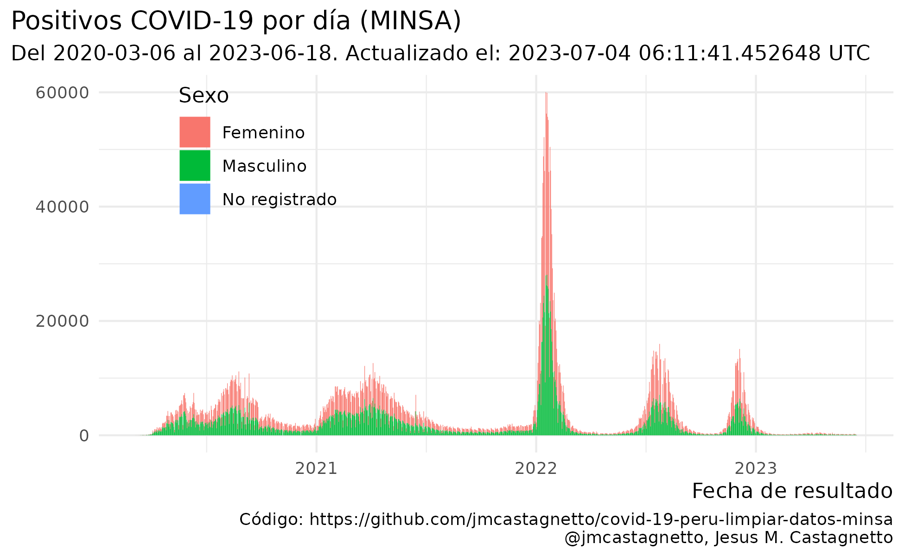

**Última actualización**: 2020-08-01 19:46:21 UTC

Notas
-----

**2020-05-22**

-   La limpieza de datos no está completa aún, hay fechas de tomas de
    prueba que parecen ser incorrectas, y que al convertir dan fechas
    inconsistentes con el primer caso reportado (2020-03-06).
-   En al menos un caso, la fecha de toma de pruebas es copia de la
    fecha de nacimiento.
-   He agregado una columna `fecha_prueba_antes_primer_caso` para marcar
    esos registros. Son 126 registros que tienen este problema.

**2020-05-23**

-   Los datos han cambiado de formato, ya no incluyen la fecha de
    nacimiento, sino la edad en años.
-   El campo de fecha que se tiene ahora ya no es `FECHA_PRUEBA` sino
    `FECHA_RESULTADO`
-   El campo de tipo de prueba (antes `TIPO_PRUEBA`) se llama ahora
    `METODODX`
-   Hay 4,543 registros sin fecha de resultado conocida
-   Ya no hay incosistencias en los formatos de fecha, todos los
    registros con valores son de la forma “DD/MM/YYYY”
-   Tampoco hay errores como fechas anteriores al primer caso reportado
    oficialmente.
-   Usando edad, departamento, provincia y distrito se han podidor
    reconstruir unos 2,933 registros de casos con fallecimientos

**2020-05-28**

-   Hay nuevos datasets de positivos y fallecimientos, ahora ambos en
    formato CSV, pero no en UTF-8:
    -   [“Casos positivos por COVID-19 - \[Ministerio de Salud -
        MINSA\]”](https://www.datosabiertos.gob.pe/dataset/casos-positivos-por-covid-19-ministerio-de-salud-minsa)
    -   [“Fallecidos por COVID-19 - \[Ministerio de Salud -
        MINSA\]”](https://www.datosabiertos.gob.pe/dataset/fallecidos-por-covid-19-ministerio-de-salud-minsa)

**2020-05-31**

-   Nuevo cambio de formato en los datos de fallecimientos: en 749 de
    registros no se consigna la fecha de nacimiento, pero se ha agregado
    una columna `EDAD_DECLARADA`.
-   He modificado el código para compensar por estos cambios.
-   También, **todos los 141 fallecimientos asignados al 2020-05-29
    están designados como de sexo `INDETERMINADO`**.

**2020-06-12**

-   Al menos a partir de ayer, ya aparecen nuevamente los valores
    definidos para el sexo en los datos.

**2020-06-23**

-   Hay datos que tienen como fecha de el 2020-12-06, cuando podría
    parecer que es 2020-06-12, esto se ha corregido en los datos limpios
    en el repo, mas no el original.

**2020-07-28**

-   Luego de varios días sin actualización (al menos 3 días), los datos
    abiertos han sido actualizados.
-   Las fechas en los registros ha cambiado del formato DD/MM/YYY (y
    algunos MM/DD/YYYY) a YYYYMMDD

Información relevante
---------------------

Fuentes de datos:

-   <a href="https://www.datosabiertos.gob.pe/dataset/casos-positivos-por-covid-19-ministerio-de-salud-minsa" class="uri">https://www.datosabiertos.gob.pe/dataset/casos-positivos-por-covid-19-ministerio-de-salud-minsa</a>
-   <a href="https://www.datosabiertos.gob.pe/dataset/fallecidos-por-covid-19-ministerio-de-salud-minsa" class="uri">https://www.datosabiertos.gob.pe/dataset/fallecidos-por-covid-19-ministerio-de-salud-minsa</a>

Luego del primer paso de limpieza de datos:

         uuid                departamento               provincia     
     Length:407492      LIMA       :196476   LIMA            :189116  
     Class :character   PIURA      : 21069   CALLAO          : 19952  
     Mode  :character   CALLAO     : 21045   EN INVESTIGACIÓN: 17147  
                        LIMA REGION: 17183   AREQUIPA        : 12093  
                        LAMBAYEQUE : 17111   CHICLAYO        : 11469  
                        LA LIBERTAD: 14936   TRUJILLO        : 10874  
                        (Other)    :119672   (Other)         :146841  
                       distrito      metododx          edad       
     SAN JUAN DE LURIGANCHO: 18701   PCR:109425   Min.   :  0.00  
     EN INVESTIGACIÓN      : 17147   PR :298067   1st Qu.: 31.00  
     LIMA                  : 16615                Median : 42.00  
     SAN MARTIN DE PORRES  : 13460                Mean   : 43.35  
     COMAS                 : 11610                3rd Qu.: 55.00  
     CALLAO                : 11263                Max.   :120.00  
     (Other)               :318696                NA's   :14      
            sexo        fecha_resultado     
     Femenino :177937   Min.   :2020-03-06  
     Masculino:229555   1st Qu.:2020-05-17  
                        Median :2020-06-07  
                        Mean   :2020-06-07  
                        3rd Qu.:2020-07-04  
                        Max.   :2020-07-29  
                                            

         uuid           fecha_fallecimiento       edad               sexo      
     Length:19021       Min.   :2020-03-18   Min.   :  0.00   Femenino : 5569  
     Class :character   1st Qu.:2020-05-10   1st Qu.: 57.00   Masculino:13452  
     Mode  :character   Median :2020-06-08   Median : 66.00                    
                        Mean   :2020-06-05   Mean   : 65.62                    
                        3rd Qu.:2020-07-02   3rd Qu.: 75.00                    
                        Max.   :2020-07-29   Max.   :107.00                    
                                                                               
       fecha_nac               departamento     provincia   
     Min.   :1912-12-15   LIMA       :8993   LIMA    :7781  
     1st Qu.:1944-07-12   LA LIBERTAD:1331   TRUJILLO: 963  
     Median :1953-08-05   PIURA      :1254   CALLAO  : 866  
     Mean   :1954-04-25   LAMBAYEQUE :1216   CHICLAYO: 676  
     3rd Qu.:1962-11-28   CALLAO     :1026   AREQUIPA: 671  
     Max.   :2020-02-12   ANCASH     : 825   (Other) :6726  
     NA's   :919          (Other)    :4376   NA's    :1338  
                       distrito       edad_calc     
     SAN JUAN DE LURIGANCHO:  928   Min.   :  0.17  
     LIMA                  :  668   1st Qu.: 57.52  
     CALLAO                :  575   Median : 66.85  
     SAN MARTIN DE PORRES  :  567   Mean   : 66.12  
     VILLA EL SALVADOR     :  546   3rd Qu.: 75.90  
     (Other)               :14932   Max.   :107.53  
     NA's                  :  805   NA's   :919     

      uuid_caso              departamento       provincia     
     Length:268855      LIMA       :211005   LIMA    :211005  
     Class :character   CALLAO     : 21005   CALLAO  : 21005  
     Mode  :character   LA LIBERTAD:  7597   TRUJILLO:  7323  
                        LAMBAYEQUE :  5765   CHICLAYO:  5398  
                        ANCASH     :  5392   SANTA   :  5082  
                        PIURA      :  5180   PIURA   :  3064  
                        (Other)    : 12911   (Other) : 15978  
                       distrito      metododx          edad       
     SAN JUAN DE LURIGANCHO: 54021   PCR: 81200   Min.   :  0.00  
     LIMA                  : 26377   PR :187655   1st Qu.: 50.00  
     SAN MARTIN DE PORRES  : 22902                Median : 58.00  
     COMAS                 : 18505                Mean   : 57.81  
     CALLAO                : 17754                3rd Qu.: 66.00  
     VILLA EL SALVADOR     : 14354                Max.   :101.00  
     (Other)               :114942                                
            sexo        fecha_resultado      uuid_fallecimiento
     Femenino : 52657   Min.   :2020-03-07   Length:268855     
     Masculino:216198   1st Qu.:2020-04-29   Class :character  
                        Median :2020-05-19   Mode  :character  
                        Mean   :2020-05-18                     
                        3rd Qu.:2020-06-04                     
                        Max.   :2020-07-28                     
                                                               
     fecha_fallecimiento    fecha_nac            edad_calc      coincidencias   
     Min.   :2020-03-19   Min.   :1919-01-11   Min.   :  0.26   Min.   : 1.000  
     1st Qu.:2020-06-08   1st Qu.:1953-12-24   1st Qu.: 50.39   1st Qu.: 2.000  
     Median :2020-06-25   Median :1961-11-29   Median : 58.56   Median : 4.000  
     Mean   :2020-06-22   Mean   :1962-02-27   Mean   : 58.32   Mean   : 5.273  
     3rd Qu.:2020-07-13   3rd Qu.:1970-01-29   3rd Qu.: 66.50   3rd Qu.: 7.000  
     Max.   :2020-07-29   Max.   :2020-02-12   Max.   :101.48   Max.   :26.000  
                                                                                

Hay coincidencias entre casos y fallecimientos, usando edad, sexo y
lugar en 47259 casos reconstruídos.

    [1] "es_PE.utf8"

Los archivos “limpios” son:

-   [datos/fallecidos\_covid-utf8-limpio.csv](datos/fallecidos_covid-utf8-limpio.csv)
-   [datos/positivos\_covid-utf8-limpio.csv](datos/positivos_covid-utf8-limpio.csv)

Y algunos reconstruidos a partir de los anteriores:

-   [datos/casos\_fallecimientos\_reconstruccion\_posible.csv](datos/casos_fallecimientos_reconstruccion_posible.csv)
-   [datos/timeseries-casos.csv](datos/timeseries-casos.csv)
-   [datos/timeseries-casos-lugares.csv](datos/timeseries-casos-lugares.csv)
-   [datos/timeseries-fallecimientos.csv](datos/timeseries-fallecimientos.csv)
-   [datos/timeseries-fallecimientos-lugares.csv](datos/timeseries-fallecimientos-lugares.csv)
