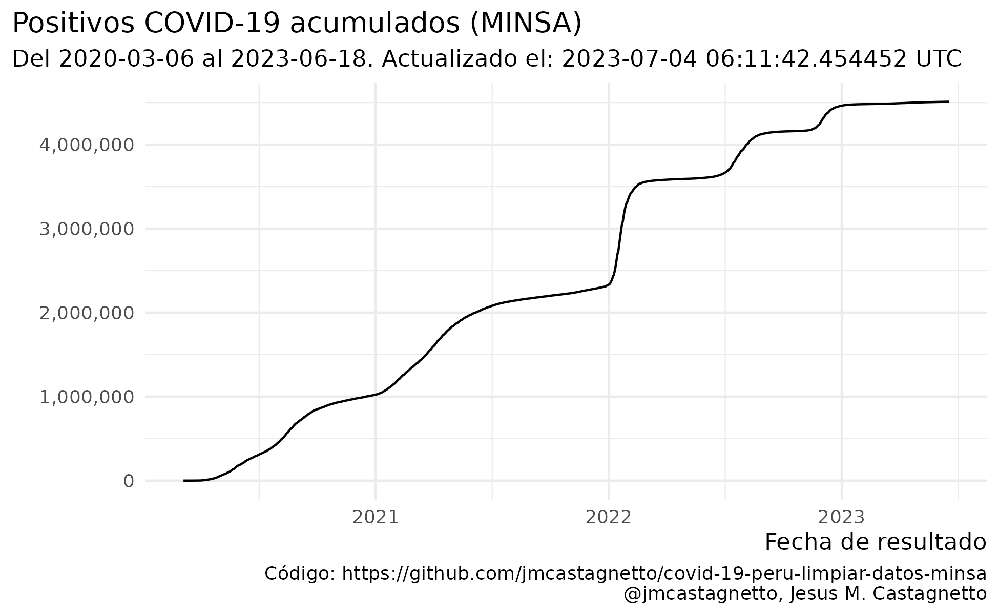

**Última actualización**: 2020-08-11 17:23:17 UTC

Notas
-----

**2020-05-22**

-   La limpieza de datos no está completa aún, hay fechas de tomas de
    prueba que parecen ser incorrectas, y que al convertir dan fechas
    inconsistentes con el primer caso reportado (2020-03-06).
-   En al menos un caso, la fecha de toma de pruebas es copia de la
    fecha de nacimiento.
-   He agregado una columna `fecha_prueba_antes_primer_caso` para marcar
    esos registros. Son 126 registros que tienen este problema.

**2020-05-23**

-   Los datos han cambiado de formato, ya no incluyen la fecha de
    nacimiento, sino la edad en años.
-   El campo de fecha que se tiene ahora ya no es `FECHA_PRUEBA` sino
    `FECHA_RESULTADO`
-   El campo de tipo de prueba (antes `TIPO_PRUEBA`) se llama ahora
    `METODODX`
-   Hay 4,543 registros sin fecha de resultado conocida
-   Ya no hay incosistencias en los formatos de fecha, todos los
    registros con valores son de la forma “DD/MM/YYYY”
-   Tampoco hay errores como fechas anteriores al primer caso reportado
    oficialmente.
-   Usando edad, departamento, provincia y distrito se han podidor
    reconstruir unos 2,933 registros de casos con fallecimientos

**2020-05-28**

-   Hay nuevos datasets de positivos y fallecimientos, ahora ambos en
    formato CSV, pero no en UTF-8:
    -   [“Casos positivos por COVID-19 - \[Ministerio de Salud -
        MINSA\]”](https://www.datosabiertos.gob.pe/dataset/casos-positivos-por-covid-19-ministerio-de-salud-minsa)
    -   [“Fallecidos por COVID-19 - \[Ministerio de Salud -
        MINSA\]”](https://www.datosabiertos.gob.pe/dataset/fallecidos-por-covid-19-ministerio-de-salud-minsa)

**2020-05-31**

-   Nuevo cambio de formato en los datos de fallecimientos: en 749 de
    registros no se consigna la fecha de nacimiento, pero se ha agregado
    una columna `EDAD_DECLARADA`.
-   He modificado el código para compensar por estos cambios.
-   También, **todos los 141 fallecimientos asignados al 2020-05-29
    están designados como de sexo `INDETERMINADO`**.

**2020-06-12**

-   Al menos a partir de ayer, ya aparecen nuevamente los valores
    definidos para el sexo en los datos.

**2020-06-23**

-   Hay datos que tienen como fecha de el 2020-12-06, cuando podría
    parecer que es 2020-06-12, esto se ha corregido en los datos limpios
    en el repo, mas no el original.

**2020-07-28**

-   Luego de varios días sin actualización (al menos 3 días), los datos
    abiertos han sido actualizados.
-   Las fechas en los registros ha cambiado del formato DD/MM/YYY (y
    algunos MM/DD/YYYY) a YYYYMMDD

Información relevante
---------------------

Fuentes de datos:

-   <a href="https://www.datosabiertos.gob.pe/dataset/casos-positivos-por-covid-19-ministerio-de-salud-minsa" class="uri">https://www.datosabiertos.gob.pe/dataset/casos-positivos-por-covid-19-ministerio-de-salud-minsa</a>
-   <a href="https://www.datosabiertos.gob.pe/dataset/fallecidos-por-covid-19-ministerio-de-salud-minsa" class="uri">https://www.datosabiertos.gob.pe/dataset/fallecidos-por-covid-19-ministerio-de-salud-minsa</a>

Luego del primer paso de limpieza de datos:

         uuid                departamento               provincia     
     Length:483133      LIMA       :224836   LIMA            :214644  
     Class :character   CALLAO     : 23090   EN INVESTIGACIÓN: 22687  
     Mode  :character   PIURA      : 22736   CALLAO          : 21894  
                        AREQUIPA   : 19883   AREQUIPA        : 17717  
                        LIMA REGION: 19684   TRUJILLO        : 12770  
                        LAMBAYEQUE : 18875   CHICLAYO        : 12635  
                        (Other)    :154029   (Other)         :180786  
                       distrito      metododx          edad       
     EN INVESTIGACIÓN      : 22687   PCR:124415   Min.   :  0.00  
     SAN JUAN DE LURIGANCHO: 21377   PR :358718   1st Qu.: 31.00  
     LIMA                  : 18695                Median : 42.00  
     SAN MARTIN DE PORRES  : 14887                Mean   : 43.28  
     COMAS                 : 13120                3rd Qu.: 55.00  
     CALLAO                : 12183                Max.   :120.00  
     (Other)               :380184                NA's   :54      
            sexo        fecha_resultado     
     Femenino :215409   Min.   :2020-03-06  
     Masculino:267724   1st Qu.:2020-05-21  
                        Median :2020-06-15  
                        Mean   :2020-06-16  
                        3rd Qu.:2020-07-19  
                        Max.   :2020-08-09  
                                            

         uuid           fecha_fallecimiento       edad               sexo      
     Length:21276       Min.   :2020-03-18   Min.   :  0.00   Femenino : 6227  
     Class :character   1st Qu.:2020-05-13   1st Qu.: 57.00   Masculino:15049  
     Mode  :character   Median :2020-06-12   Median : 66.00                    
                        Mean   :2020-06-11   Mean   : 65.64                    
                        3rd Qu.:2020-07-10   3rd Qu.: 75.00                    
                        Max.   :2020-08-09   Max.   :107.00                    
                                                                               
       fecha_nac               departamento     provincia   
     Min.   :1912-12-15   LIMA       :9993   LIMA    :8736  
     1st Qu.:1944-06-27   LA LIBERTAD:1432   TRUJILLO:1024  
     Median :1953-08-05   PIURA      :1320   CALLAO  : 942  
     Mean   :1954-04-25   LAMBAYEQUE :1263   AREQUIPA: 840  
     3rd Qu.:1962-12-15   CALLAO     :1103   CHICLAYO: 713  
     Max.   :2020-02-12   ICA        : 989   (Other) :7743  
     NA's   :1154         (Other)    :5176   NA's    :1278  
                       distrito       edad_calc     
     SAN JUAN DE LURIGANCHO: 1043   Min.   :  0.17  
     LIMA                  :  743   1st Qu.: 57.47  
     CALLAO                :  633   Median : 66.86  
     SAN MARTIN DE PORRES  :  615   Mean   : 66.13  
     COMAS                 :  591   3rd Qu.: 75.95  
     (Other)               :16903   Max.   :107.53  
     NA's                  :  748   NA's   :1154    

      uuid_caso              departamento       provincia     
     Length:322736      LIMA       :254879   LIMA    :254879  
     Class :character   CALLAO     : 23782   CALLAO  : 23782  
     Mode  :character   LA LIBERTAD:  8660   TRUJILLO:  8317  
                        LAMBAYEQUE :  6348   CHICLAYO:  5918  
                        ANCASH     :  6016   SANTA   :  5644  
                        PIURA      :  5608   AREQUIPA:  3913  
                        (Other)    : 17443   (Other) : 20283  
                       distrito      metododx          edad       
     SAN JUAN DE LURIGANCHO: 66279   PCR: 97475   Min.   :  0.00  
     LIMA                  : 31266   PR :225261   1st Qu.: 50.00  
     SAN MARTIN DE PORRES  : 27048                Median : 58.00  
     COMAS                 : 22363                Mean   : 57.71  
     CALLAO                : 20360                3rd Qu.: 66.00  
     ATE                   : 16513                Max.   :101.00  
     (Other)               :138907                                
            sexo        fecha_resultado      uuid_fallecimiento
     Femenino : 63813   Min.   :2020-03-07   Length:322736     
     Masculino:258923   1st Qu.:2020-05-01   Class :character  
                        Median :2020-05-20   Mode  :character  
                        Mean   :2020-05-21                     
                        3rd Qu.:2020-06-07                     
                        Max.   :2020-08-07                     
                                                               
     fecha_fallecimiento    fecha_nac            edad_calc      coincidencias 
     Min.   :2020-03-19   Min.   :1919-01-11   Min.   :  0.26   Min.   : 1.0  
     1st Qu.:2020-06-10   1st Qu.:1954-01-15   1st Qu.: 50.35   1st Qu.: 2.0  
     Median :2020-06-30   Median :1961-12-18   Median : 58.49   Median : 4.0  
     Mean   :2020-06-28   Mean   :1962-04-10   Mean   : 58.22   Mean   : 5.7  
     3rd Qu.:2020-07-22   3rd Qu.:1970-02-22   3rd Qu.: 66.50   3rd Qu.: 8.0  
     Max.   :2020-08-08   Max.   :2020-02-12   Max.   :101.48   Max.   :27.0  
                                                                              

Hay coincidencias entre casos y fallecimientos, usando edad, sexo y
lugar en 54910 casos reconstruídos.

    [1] "es_PE.utf8"

Los archivos “limpios” son:

-   [datos/fallecidos\_covid-utf8-limpio.csv](datos/fallecidos_covid-utf8-limpio.csv)
-   [datos/positivos\_covid-utf8-limpio.csv](datos/positivos_covid-utf8-limpio.csv)

Y algunos reconstruidos a partir de los anteriores:

-   [datos/casos\_fallecimientos\_reconstruccion\_posible.csv](datos/casos_fallecimientos_reconstruccion_posible.csv)
-   [datos/timeseries-casos.csv](datos/timeseries-casos.csv)
-   [datos/timeseries-casos-lugares.csv](datos/timeseries-casos-lugares.csv)
-   [datos/timeseries-fallecimientos.csv](datos/timeseries-fallecimientos.csv)
-   [datos/timeseries-fallecimientos-lugares.csv](datos/timeseries-fallecimientos-lugares.csv)
